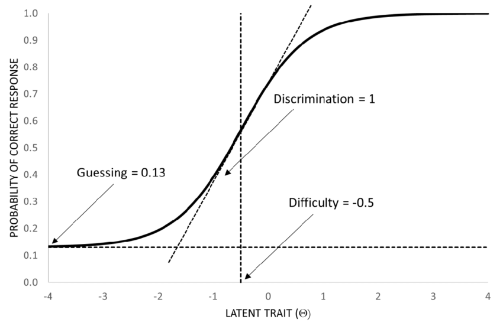
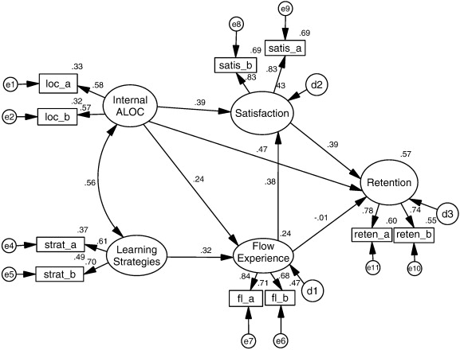
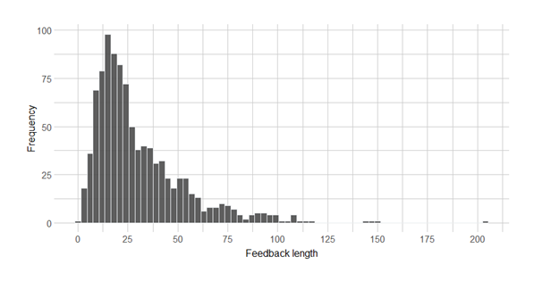

# R-DataAnalysis
Advanced data analysis in R, including Structural Equation Modeling, Item Response Theory, and visualization.

---

## IRT (Item Response Theory)
- `IRT\` 
- **Purpose**: Models the relationship between participants’ responses to survey or test items and their underlying traits (e.g., ability, attitude).  
- **Insights**: Helps identify item difficulty and discrimination, and estimates participants’ latent abilities. Useful for evaluating student learning outcomes or survey constructs in educational research.

**Example:**  

---

## SEM (Structural Equation Modeling)
- `SEM\`  
- **Purpose**:  
  - **Confirmatory Factor Analysis (CFA)** – Tests whether observed variables reflect latent constructs.  
  - **Structural Equation Modeling (SEM)** – Tests relationships between latent variables.  
- **Insights**: Enables understanding of complex relationships in education data, such as how different aspects of student engagement influence learning outcomes.

**Example:**  

---

## Data Visualization
- `Plot/`  
- **Purpose**: Visualize patterns in data to communicate findings clearly.  

---
